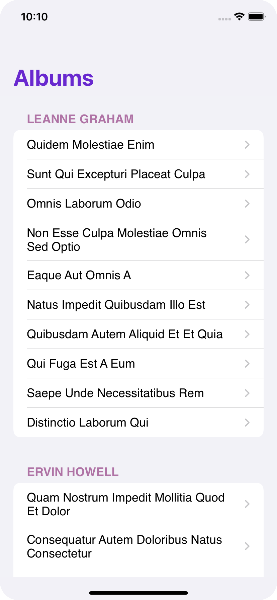
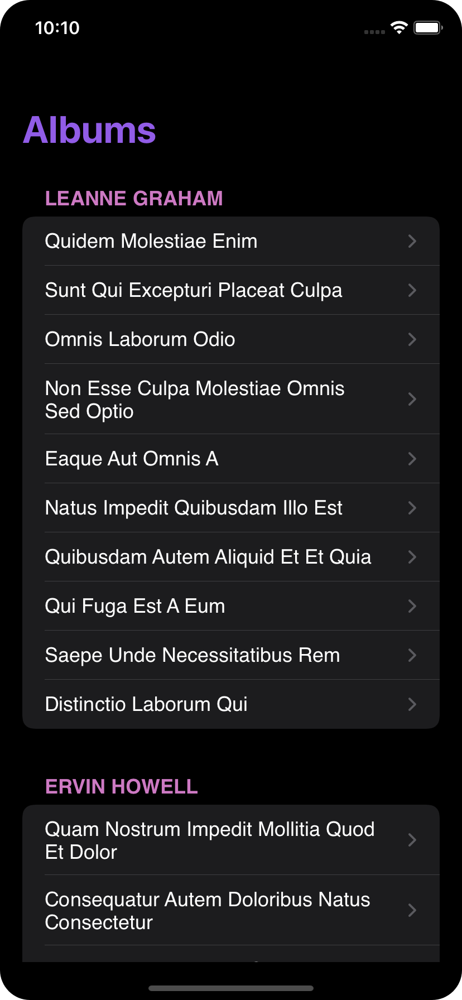
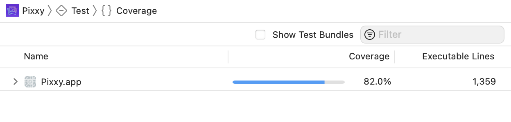

# Pixxy
 

    
  

    Pixxy is a simple photo album application developed for iOS. >  [_Live Demo_](https://drive.google.com/file/d/12NfmBl_SAlEjKJyxicrXPxXOwu_Pm762/view?usp=sharing). 
  

## Table of Contents
* [General Information](#general-information)
* [Technologies Used](#technologies-used)
* [Features](#features)
* [Design Decisions and Assumptions](#design-decisions-and-assumptions)
* [Room for Improvement](#room-for-improvement)

## General Information
- This app has been developed to demonstrate the skills of providing a production-ready iOS app. 
- Even though this is an assignment, I assumed it as a live application that needs to be developed and put into production within a short period. So all my Architectural decisions and other designs are based on that assumption.
- I had to take certain assumption while desinging this app as the requirement was given in very highlevel. All my architectural decisions and assumptions are listed below.
- The evaluator of this project kindly requested to contact me using the following email address for clarifications. ganuke@gmail.com

## Technologies Used
- Swift - version 5.5.1
- Combine Framework
- MVVM Architecture
- Storyboards
- Xcode - 13.1

## Features

- View all available photo albums in a table view categorized by owner's name.
- View the collection of photos as thumbnails for a selected album.
- View the original image for the selected thumbnail image with an awsome animation similar to Apple's Photo app.
- Support for Dark Mode.
- Internationalization.
- Higher test coverage.

## Design Decisions and Assumptions

### Application Architecture Related

#### Minimum iOS Version to be supported
Due to security issues, I have opted out of any version below iOS 13. After checking the current iOS version usage, I decided to opted iOS 13 as the minimum supported OS since I want this app to be used by many users. [_current usage_](https://iosref.com/ios-usage)
 
#### Application Architecture
I select MVVM architecture. With MVVM, it’s easier to separate business logic from presentation logic which improves the testability of the app. One prime goal of this application is to have a very good coverage.

#### Model Binding
When start developing the application, there were several options that I could choose from. Those are Combine Framework, RxSwift, or Swift closures. I opted out RxSwift since I do not want to add any 3rd party dependencies to this particular project. Then I used the Combine framework as it also supports iOS 13 and up. 

#### Concurrency
Since Swift's Async/Await is supported by iOS 15 and above I can't use it in this app. Then I selected the Combine framework to perform all asynchronous tasks as I already decided to use it for model binding and opted out of using closures.

#### Networking
My options here are to use AlamoreFire for HTTP requests and use Kingfisher for downloading images. But I developed my own methods to deal with HTTP requests and image downloading functionality since both of them are 3rd party libraries.

#### Storage
This application uses URLCaches to chach images. It uses in memory cache as well as uses disk space. Amount of the memory and disk space to be used for the cache is configurable. 

#### UIs
Since I have to develop the application using UIKit only, my options here are to use storyboards or do UI programmatically. Due to the time constraints of this project and I will be the only developer, I chose to do UIs using Storyboards which is faster. So I can use saved time to other important tasks similar to completing more Unit and UI testings which are important. 
 
### Application Flow

#### Dealing with Network Failures
- This application pulls data from 3 web services. Those are Albums, Users, and Photos. So I had to decide what needs to be done when each service gets failed. So I designed the application in the following way. 

- Since there is no dependency between Album and Users endpoints, I send both requests parallelly. Then I waited and process both responses at once. To achieve that I use DispatchGroup. Combine's Zip operator is also a good candidate to fulfill this requirement.

- The app will process both User's and Album's responses and categorize albums based on their owner if both requests get completed without any issues. Then the app will list albums in different sections by displaying the owner's name in the section header. 

- If the Users endpoint fails, the app will process album data without incorporating user details. So In the UI, all the albums will be listed in a single section in the table view. I assumed that showing the user detail is not critical for this application. I have done several Unit and UI test cases specifically to test this scenario.

- The app will show a error message with a retry option if the Album endpoint fails at application launch as it is considered to be the backbone of this application.

- And also, the App will show an error message with a retry option when the Photos API get failed.

- The app will shows a corrupted image icon to notify user if any of the image download requests get failed. 

## Unit and UI Testing

I have written many test cases to test all my ViewModel and also, several UI tests to test view controllers. Current test coverage for the project is above 70%.

## Room for Improvement
This application can be improved by adding following features

- Can add a search bar in the Album view so that users can search albums by album name or by owner's name.
- Can automatically download and add the first thumbinail image of each album to the relevant table view cell. So, user can have a preview what kind of photos included in each album. 

### Thank you.
